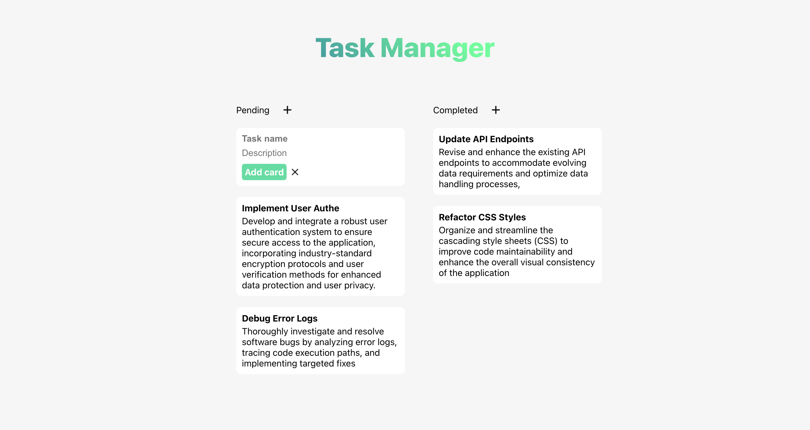

<h1>Task Manager</h1>
<h2>Presentation</h2>
<b>Task Manager</b> is a simple todo list. This project utilizes the ReactJs library.
<h1>Project Compilation</h1>
<b>⚠️ A docker container will be added to simplify the compilation process ⚠️</b>  
Launch this command in a terminal:
<pre>npm start</pre>
</img>
